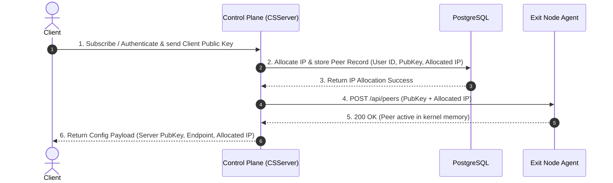

```
┌──────────────────────────────────────────────────────────────┐
│                       POSTGRESQL DB                          │
├──────────────────────────────────────────────────────────────┤
│ 1. IPAM (IP Address Management):                             │
│    Prevents IP collisions by tracking assigned internal IPs  │
│    (e.g., User A gets 10.10.1.2/32, User B gets 10.10.1.3/32)│
│                                                              │
│ 2. Device / Peer Registry:                                   │
│    Stores [user_id, public_key, allocated_ip, is_active]     │
│                                                              │
│ 3. Disaster Recovery / Exit Node Reboots:                    │
│    WireGuard stores peers in volatile kernel memory.         │
│    If an exit node restarts, it boots back up EMPTY!         │
│    The DB allows a boot script to re-populate all peers:     │
│    `SELECT public_key, ip FROM peers WHERE active = true`    │
│                                                              │
│ 4. Subscription State Synchronization:                       │
│    When Stripe fires `invoice.payment_failed`, DB marks      │
│    `is_active = false` and triggers revocation.              │
└──────────────────────────────────────────────────────────────┘
```

1. public key to encrypt traffic going to clients
2. jwt id for verifying its a user
