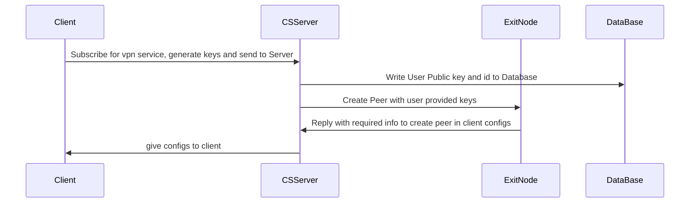
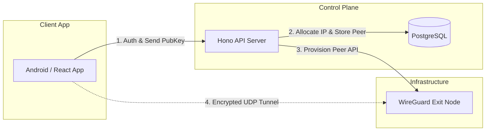
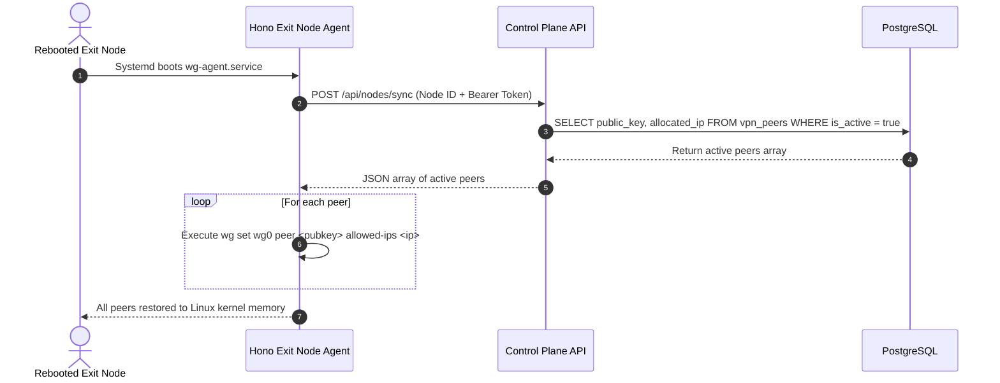

# Top Level Flow

## Why DB

1. It will be used to store user keys etc to update peer config ih for any reason previous configs curropt

# VPN Infrastructure Architecture

This document describes the system architecture, component interactions, sequence flows, and database responsibilities for the WireGuard VPN control plane and exit node infrastructure.

---

## 1. System Overview

```mermaid
sequenceDiagram
  autonumber
  actor Client as Mobile Client
  participant CSServer as Control Plane (Hono)
  participant DataBase as PostgreSQL
  participant ExitNode as Exit Node Agent

  Client->>Client: 1. Generate local X25519 Keypair (@noble/curves)
  Client->>CSServer: 2. POST /api/peers (publicKey)

  rect rgb(20, 20, 20)
    Note over CSServer,DataBase: IPAM & Persistence Phase
    CSServer->>DataBase: 3. Select next free IP & insert peer record
    DataBase-->>CSServer: 4. Confirm DB insert (e.g., 10.10.1.5/32)
  end

  rect rgb(40, 40, 40)
    Note over CSServer,ExitNode: Runtime Kernel Sync
    CSServer->>ExitNode: 5. POST /api/peers (publicKey, allocatedIp)
    ExitNode->>ExitNode: Exec: wg set wg0 peer <pubkey> allowed-ips 10.10.1.5/32
    ExitNode-->>CSServer: 6. 200 OK
  end

  CSServer-->>Client: 7. Return Server PubKey, Endpoint IP, Allocated IP
  Client->>ExitNode: 8. Handshake & Establish UDP WireGuard Tunnel
```

## Exit Node

1. create peer
2. revoke peer
3. handshake with client
