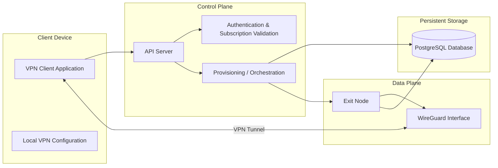
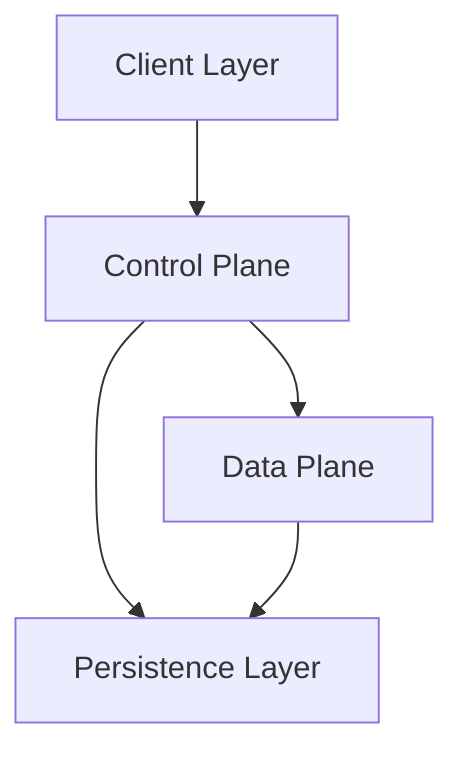
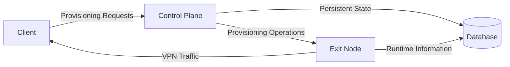
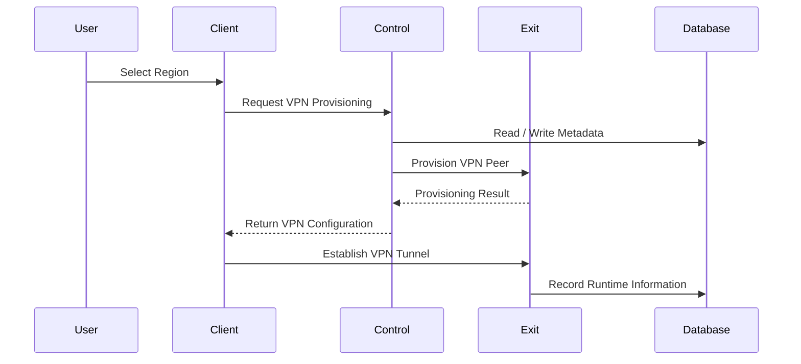

# System Overview

> This document provides a high-level overview of the VPN MVP architecture.
>
> The purpose of this document is to explain the major components of the system,
> how they interact, and the boundaries between them.
>
> This document intentionally avoids implementation-specific decisions.
> Detailed workflows are documented in separate architecture documents.

---

# Architecture Goals

The architecture is designed around the following principles:

- Extremely simple customer experience
- Separation between Control Plane and Data Plane
- Stateless orchestration whenever possible
- Independent scaling of system components
- Future support for multiple regions and exit nodes
- Minimal client interaction during normal usage

The desired customer workflow is:

1. User signs in.
2. User purchases an active subscription.
3. User selects a VPN region.
4. User presses **Connect**.

Whenever possible, subsequent connections should avoid unnecessary communication
with the Control Plane.

---

# High-Level Architecture

---

# Major Components

The system consists of four major components.

## 1. Client Application

The Client Application is responsible for the user experience.

Its responsibilities include:

- User interaction
- Region selection
- Connect / Disconnect actions
- Secure storage of VPN configuration
- Creating or storing WireGuard configuration
- Connecting to an Exit Node
- Detecting connection failures
- Requesting updated configuration when necessary

The client should remain lightweight.

Business logic should remain inside the Control Plane whenever possible.

---

## 2. Control Plane

The Control Plane acts as the central coordinator of the system.

It is responsible for orchestrating all provisioning operations.

Typical responsibilities include:

- User authentication
- Subscription verification
- Region lookup
- Exit node selection
- Peer provisioning
- Configuration generation
- Configuration updates
- Configuration revocation
- Maintaining system metadata
- Recording provisioning information

The Control Plane is responsible for making decisions.

It does **not** transport VPN traffic.

---

## 3. Exit Node

Exit Nodes form the VPN Data Plane.

Each Exit Node hosts one or more VPN interfaces and accepts VPN client
connections.

Responsibilities include:

- Hosting WireGuard interfaces
- Accepting VPN peers
- Encrypting VPN traffic
- Forwarding Internet traffic
- Reporting runtime information
- Maintaining active VPN sessions

Exit Nodes should primarily focus on networking responsibilities rather than
business logic.

---

## 4. Database

The database stores the persistent state of the platform.

Typical information includes:

- Users
- Subscriptions
- Regions
- Exit Nodes
- Peer assignments
- Provisioning history
- Connection metadata
- Configuration metadata

The database acts as the long-term source of system information.

---

# Architectural Layers

Each layer has a clearly defined responsibility.

The Client communicates with the Control Plane for provisioning-related
operations.

The Client communicates with the Data Plane for VPN traffic.

The Data Plane provides networking functionality.

The Persistence Layer stores long-term platform state.

---

# Separation of Responsibilities

The Control Plane coordinates the platform.

The Exit Node provides networking.

The Client consumes VPN services.

The Database stores persistent information.

---

# Typical Interaction

At a high level, the system operates as follows.

This sequence is simplified.

Detailed provisioning sequences are documented separately.

---

# Communication Overview

The architecture contains two primary communication paths.

## Control Path

The Control Path manages platform operations.

Examples include:

- Authentication
- Subscription validation
- Provisioning
- Configuration updates
- Peer registration
- Revocation

This path communicates with the Control Plane.

---

## Data Path

The Data Path transports encrypted VPN traffic.

After a VPN tunnel is established, user traffic flows directly between:

- Client
- Exit Node

The Control Plane is not part of the normal VPN traffic path.

---

# Scaling Considerations

Each major component is designed to scale independently.

Future deployments may contain:

- Multiple Control Plane instances
- Multiple Exit Nodes
- Multiple Regions
- Multiple Databases or database replicas
- Additional infrastructure services

The architecture intentionally separates orchestration from networking to
allow independent scaling.

---

# Related Documents

The following documents describe specific parts of the architecture in greater
detail.

| Document                               | Purpose                                  |
| -------------------------------------- | ---------------------------------------- |
| 02-component-responsibilities.md       | Responsibilities of each major component |
| 03-first-time-provisioning-sequence.md | Initial client provisioning              |
| 04-returning-connection-sequence.md    | Returning client workflow                |
| 05-reprovisioning-sequence.md          | Handling stale or invalid configurations |
| 06-subscription-revocation-sequence.md | Subscription expiration workflow         |
| 07-domain-model.md                     | Core domain entities                     |
| 08-peer-lifecycle-state-machine.md     | Peer lifecycle                           |
| 09-request-flows-summary.md            | Summary of system workflows              |
