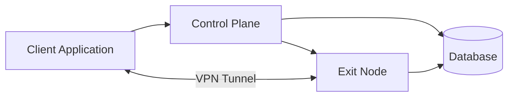
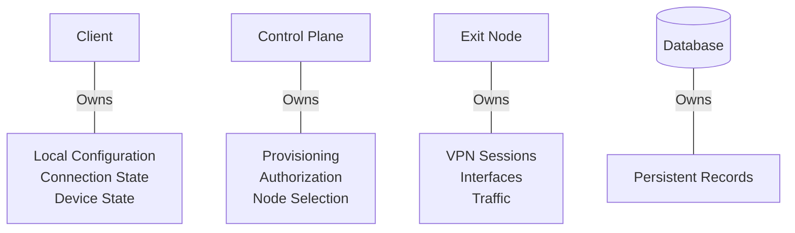
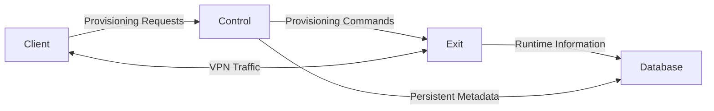

# Component Responsibilities

> This document defines the responsibilities, ownership boundaries, and communication patterns of each major component in the system.
>
> The purpose of this document is to clearly describe **what each component is responsible for**, **what it owns**, and **what it deliberately does not own**.
>
> This document avoids implementation details such as APIs, database schemas, or deployment strategies.

---

# Component Overview

---

# Responsibility Boundaries

Every component should have a clearly defined responsibility.

Business decisions should remain centralized.

Networking responsibilities should remain inside Exit Nodes.

User interaction should remain inside the Client.

Persistent platform state should remain inside the Database.

---

# Client Application

## Purpose

The Client Application provides the user interface and establishes VPN
connections.

It is the only component directly interacted with by the customer.

---

## Responsibilities

The Client Application is responsible for:

- User interaction
- Displaying available VPN regions
- Connect / Disconnect operations
- Securely storing VPN configuration
- Managing locally stored configuration
- Detecting connection failures
- Establishing VPN tunnels
- Requesting updated configuration when necessary

---

## Owns

The Client owns local device state such as:

- Cached configuration
- Local application settings
- Connection status
- Device identity
- Local WireGuard configuration

---

## Does Not Own

The Client does **not** own:

- Subscription validation
- User authorization
- Peer provisioning
- Exit node selection
- Configuration revocation
- Platform state
- Region management

These responsibilities belong elsewhere.

---

# Control Plane

## Purpose

The Control Plane coordinates the entire VPN platform.

It acts as the central orchestration layer.

Every provisioning workflow passes through the Control Plane.

---

## Responsibilities

The Control Plane is responsible for:

- Authentication
- Authorization
- Subscription verification
- Region lookup
- Selecting Exit Nodes
- Provisioning peers
- Updating peer assignments
- Revoking peers
- Recording provisioning information
- Maintaining platform metadata
- Coordinating communication with Exit Nodes

---

## Owns

The Control Plane owns platform decisions including:

- Which Exit Node should be used
- Whether provisioning is allowed
- Which configuration should be returned
- Whether an existing configuration remains valid
- Which peer belongs to which device
- Provisioning lifecycle

---

## Does Not Own

The Control Plane does **not** transport VPN traffic.

It should avoid participating in the VPN data path after provisioning is
complete.

---

# Exit Node

## Purpose

The Exit Node provides VPN connectivity.

It represents the networking layer of the platform.

---

## Responsibilities

The Exit Node is responsible for:

- Hosting VPN interfaces
- Accepting VPN peers
- Encrypting traffic
- Forwarding Internet traffic
- Maintaining active VPN sessions
- Reporting runtime information
- Executing provisioning requests received from the Control Plane

---

## Owns

The Exit Node owns runtime networking state.

Examples include:

- Active VPN interfaces
- Connected peers
- Runtime traffic statistics
- Current VPN sessions
- Interface health

---

## Does Not Own

Exit Nodes do **not** decide:

- Whether a user has an active subscription
- Whether provisioning is allowed
- Which node should be assigned
- User permissions
- Billing
- Region availability

These decisions belong to the Control Plane.

---

# Database

## Purpose

The Database stores persistent platform state.

Unlike the Exit Node, the database stores long-term information rather than
runtime networking state.

---

## Responsibilities

The Database stores information such as:

- Users
- Devices
- Peer records
- Regions
- Exit Nodes
- Subscriptions
- Provisioning history
- Connection history
- Configuration metadata
- Runtime metadata

---

## Owns

The Database owns persistent records.

These records survive:

- Application restarts
- Exit Node restarts
- Client reinstalls
- Infrastructure changes

---

## Does Not Own

The Database does not:

- Authenticate users
- Provision peers
- Forward VPN traffic
- Select Exit Nodes

It stores information rather than making platform decisions.

---

# Ownership Diagram

---

# Communication Responsibilities

Each communication path exists for a specific purpose.

Provisioning traffic is separated from VPN traffic.

Business operations are separated from networking operations.

Persistent storage is separated from runtime networking.

---

# Responsibility Matrix

| Responsibility          | Client | Control Plane | Exit Node | Database |
| ----------------------- | :----: | :-----------: | :-------: | :------: |
| User Interface          |   ✓    |               |           |          |
| Device State            |   ✓    |               |           |          |
| VPN Connection          |   ✓    |               |     ✓     |          |
| Authentication          |        |       ✓       |           |          |
| Authorization           |        |       ✓       |           |          |
| Subscription Validation |        |       ✓       |           |          |
| Region Selection        |        |       ✓       |           |          |
| Exit Node Selection     |        |       ✓       |           |          |
| Peer Provisioning       |        |       ✓       |     ✓     |          |
| VPN Traffic             |        |               |     ✓     |          |
| Runtime Sessions        |        |               |     ✓     |          |
| Persistent Records      |        |               |           |    ✓     |
| Provisioning History    |        |       ✓       |           |    ✓     |
| Platform Metadata       |        |       ✓       |           |    ✓     |

---

# Design Principles

The architecture follows several guiding principles.

## Separation of Concerns

Each component has a focused responsibility.

---

## Single Source of Truth

Platform decisions originate from a single orchestration layer.

---

## Independent Scaling

Client, Control Plane, Exit Nodes, and Database may scale independently.

---

## Loose Coupling

Components communicate through well-defined responsibilities rather than
sharing internal logic.

---

## Future Evolution

Additional components may be introduced over time without fundamentally
changing the architecture.

Examples include:

- Monitoring services
- Metrics aggregation
- Logging pipelines
- Notification systems
- Analytics platforms

The responsibilities defined in this document should remain stable as the
system evolves.
