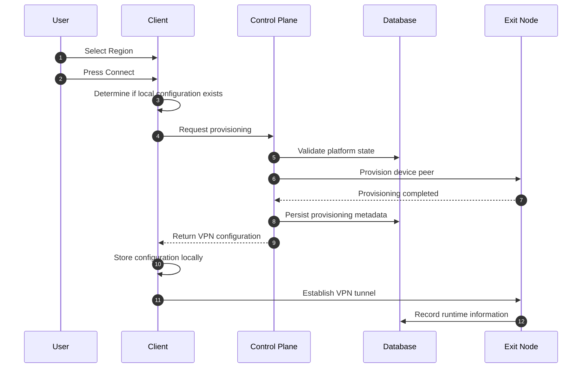
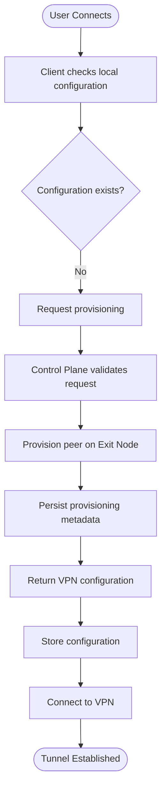
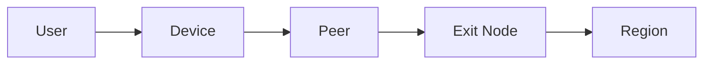
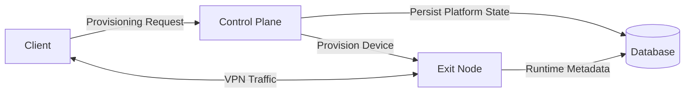
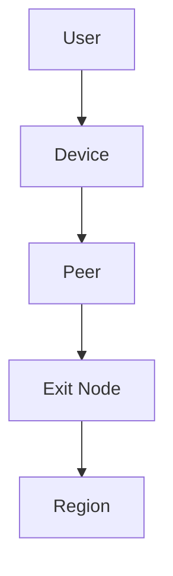

# First-Time Provisioning Sequence

> This document describes the provisioning workflow that occurs when a client attempts to connect to a VPN region for the first time, or when no usable configuration exists for the selected region.
>
> The goal of this document is to describe the sequence of interactions between the Client, Control Plane, Database, and Exit Node at a conceptual level.

---

# Overview

A first-time provisioning flow occurs when the client cannot establish a VPN
connection using an existing local configuration.

Common situations include:

- The user has never connected to the selected region.
- The local VPN configuration does not exist.
- The client has been reinstalled.
- The device is newly registered.
- Existing configuration has been removed.

During this workflow, the Control Plane provisions a VPN peer for the
requesting device and returns the information required to establish a VPN
connection.

---

# High-Level Sequence

---

# Provisioning Lifecycle

---

# Participants

## User

The user initiates the workflow by selecting a VPN region and pressing the
Connect button.

The user is not aware of the provisioning process.

---

## Client Application

The client is responsible for:

- Detecting whether a configuration already exists.
- Requesting provisioning when necessary.
- Receiving the VPN configuration.
- Persisting configuration locally.
- Establishing the VPN tunnel.

The client does not decide whether provisioning is permitted.

---

## Control Plane

The Control Plane coordinates the entire provisioning workflow.

Its responsibilities include:

- Validating the request.
- Determining whether provisioning may continue.
- Selecting an appropriate Exit Node.
- Coordinating peer provisioning.
- Recording provisioning metadata.
- Returning VPN configuration.

The Control Plane acts as the orchestration layer.

---

## Database

The database stores persistent platform information related to the
provisioning process.

Examples include:

- Device records
- Peer records
- Node assignments
- Provisioning history
- Configuration metadata

The database is not responsible for networking.

---

## Exit Node

The Exit Node performs networking-related provisioning.

Conceptually, this includes:

- Accepting a provisioning request.
- Registering the VPN peer.
- Preparing the peer for future connections.
- Returning provisioning status.

The Exit Node does not make business decisions.

---

# Conceptual Provisioning Steps

## Step 1

The user selects a VPN region and requests a connection.

---

## Step 2

The client determines whether a usable VPN configuration already exists for
the selected region.

If no usable configuration exists, provisioning begins.

---

## Step 3

The client contacts the Control Plane.

The request indicates that the selected region requires provisioning.

---

## Step 4

The Control Plane evaluates whether provisioning may proceed.

Typical platform checks may include:

- Authentication
- Subscription status
- Device status
- Region availability

This document intentionally does not define how these checks are implemented.

---

## Step 5

The Control Plane determines which Exit Node should host the device's VPN
peer.

The node selection strategy is intentionally left unspecified.

Possible selection strategies may evolve over time.

---

## Step 6

The Control Plane coordinates provisioning with the selected Exit Node.

Provisioning conceptually associates:

- Device
- Peer
- Exit Node
- Region

This relationship is illustrated below.

A peer belongs to a specific device rather than directly to a user.

---

## Step 7

After provisioning succeeds, the Control Plane records the resulting platform
state.

The exact persistence strategy is implementation-specific and intentionally
outside the scope of this document.

---

## Step 8

The Control Plane returns the VPN configuration required by the client to
establish the VPN tunnel.

The document intentionally avoids describing the structure of the returned
configuration.

---

## Step 9

The client securely stores the received configuration for future use.

Future connection attempts may reuse this configuration without requiring
another provisioning workflow.

---

## Step 10

The client establishes a VPN connection directly with the Exit Node.

From this point onward, VPN traffic flows directly between the client and the
Exit Node.

The Control Plane is no longer involved in the data path.

---

# Responsibility During Provisioning

Provisioning communication is separate from VPN traffic.

---

# Conceptual Data Ownership

This ownership hierarchy represents the conceptual relationship between the
major domain entities involved in provisioning.

---

# Notes

This document intentionally does not define:

- API endpoints
- Authentication protocols
- Database schema
- Cryptographic implementation
- Provisioning protocol
- Configuration format
- Node selection algorithm

These implementation details are expected to evolve independently of the
overall provisioning workflow.

---

# Next Document

The next document,

**`04-returning-connection-sequence.md`**,

describes the simplified workflow used when the client already possesses a
valid VPN configuration and can establish a VPN connection without requiring a
new provisioning operation.
