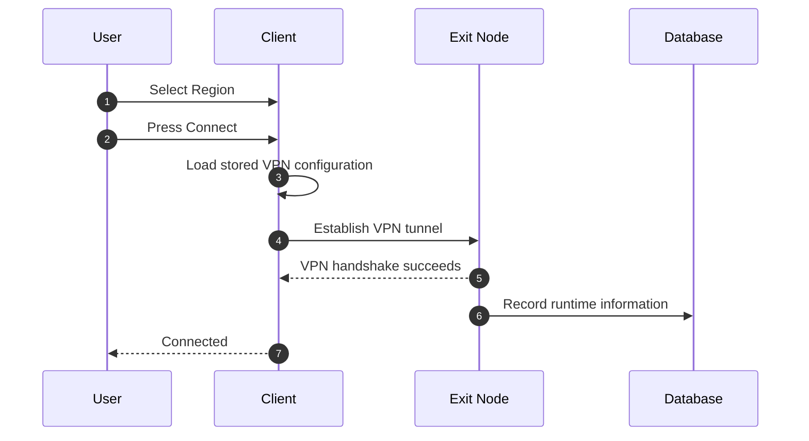
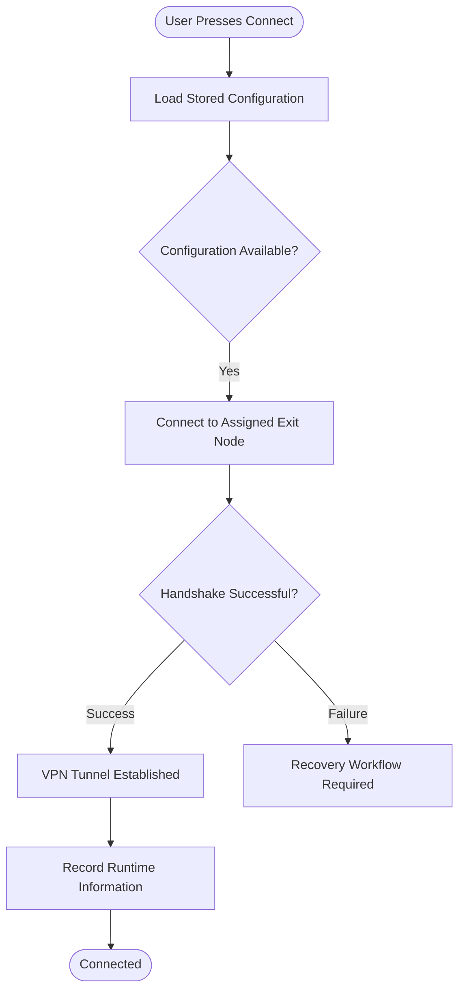
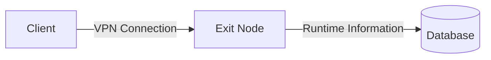
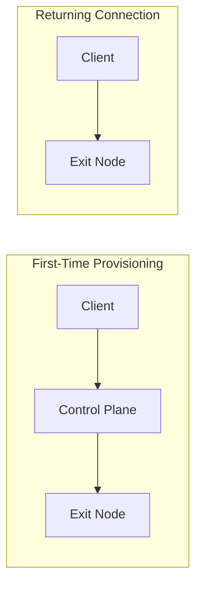

# Returning Connection Sequence

> This document describes the workflow used when a client already possesses a
> valid VPN configuration for the selected region.
>
> Unlike the initial provisioning workflow, this path avoids the Control Plane
> entirely and establishes a VPN tunnel directly with the assigned Exit Node.
>
> The objective is to minimize connection latency and reduce unnecessary load on
> the Control Plane.

---

# Overview

A returning connection occurs when the client already has a usable VPN
configuration associated with the selected region.

Typical scenarios include:

- The device has connected to this region previously.
- The stored VPN configuration remains valid.
- No reprovisioning is required.
- The assigned Exit Node is still reachable.

Since provisioning has already been completed, the client does not need to
contact the Control Plane.

Instead, it attempts to establish a VPN tunnel directly with the assigned Exit
Node.

---

# High-Level Sequence

---

# Connection Lifecycle

---

# Workflow Description

## Step 1

The user selects a VPN region and presses the **Connect** button.

---

## Step 2

The client searches for a previously stored VPN configuration associated with
the selected region.

The exact storage mechanism is implementation-specific.

---

## Step 3

If a valid configuration is available, the client prepares the VPN interface
using the locally stored information.

No interaction with the Control Plane is required.

---

## Step 4

The client establishes a VPN tunnel directly with the assigned Exit Node.

This communication occurs over the VPN protocol.

No provisioning occurs during this stage.

---

## Step 5

If the VPN handshake succeeds, encrypted traffic begins flowing between the
client and the Exit Node.

The Control Plane is not involved in transporting VPN traffic.

---

## Step 6

The Exit Node records runtime information associated with the active VPN
session.

Examples of runtime information may include:

- Peer activity
- Connection status
- Session timestamps
- Traffic statistics
- Health information

The exact set of recorded information is intentionally left undefined.

---

# Participants

## User

Initiates the connection by selecting a region and pressing **Connect**.

The user does not participate in the provisioning workflow.

---

## Client Application

Responsibilities include:

- Loading locally stored VPN configuration.
- Preparing the VPN interface.
- Establishing the VPN tunnel.
- Detecting connection failures.
- Reporting connection status to the user.

---

## Exit Node

Responsibilities include:

- Accepting VPN connections.
- Authenticating VPN peers using the VPN protocol.
- Maintaining encrypted tunnels.
- Recording runtime networking information.

---

## Database

Stores persistent runtime information generated during active VPN sessions.

This document intentionally does not define how or when runtime information is
persisted.

---

# Communication Overview

Unlike the first-time provisioning workflow, the Control Plane is not part of
this communication path.

---

# Comparison with Initial Provisioning

The returning connection path is intentionally shorter because provisioning has
already been completed.

---

# Architectural Characteristics

The returning connection workflow provides several architectural benefits.

## Reduced Latency

The client avoids contacting the Control Plane before every connection.

---

## Lower Infrastructure Load

Provisioning resources remain available for devices that genuinely require new
configuration.

---

## Better Scalability

As the number of users grows, the majority of connection attempts follow this
optimized path instead of requiring orchestration.

---

## Separation of Responsibilities

Provisioning remains a Control Plane responsibility.

Networking remains an Exit Node responsibility.

---

# Failure Conditions

This document describes only the successful returning connection workflow.

A returning connection may fail for various reasons, including:

- Stored configuration is no longer valid.
- Assigned Exit Node is unavailable.
- Configuration has been revoked.
- Network connectivity issues.
- Infrastructure changes.

When the connection cannot be established using the stored configuration, the
client transitions to the recovery workflow.

The recovery workflow is described in:

**`05-reprovisioning-sequence.md`**

---

# Design Notes

This document intentionally does not define:

- Retry behavior
- Timeout values
- Health check mechanisms
- Node failover strategies
- Configuration expiration policies
- Runtime reporting implementation

These concerns belong to future implementation decisions and should not affect
the conceptual architecture.

---

# Summary

A returning connection is the normal operating mode of the system.

Once a device has been successfully provisioned, future connections should
generally follow this workflow:

1. Load local configuration.
2. Connect directly to the assigned Exit Node.
3. Establish the VPN tunnel.
4. Record runtime information.
5. Continue normal VPN operation.

The Control Plane remains outside the VPN data path unless recovery or
reprovisioning becomes necessary.
