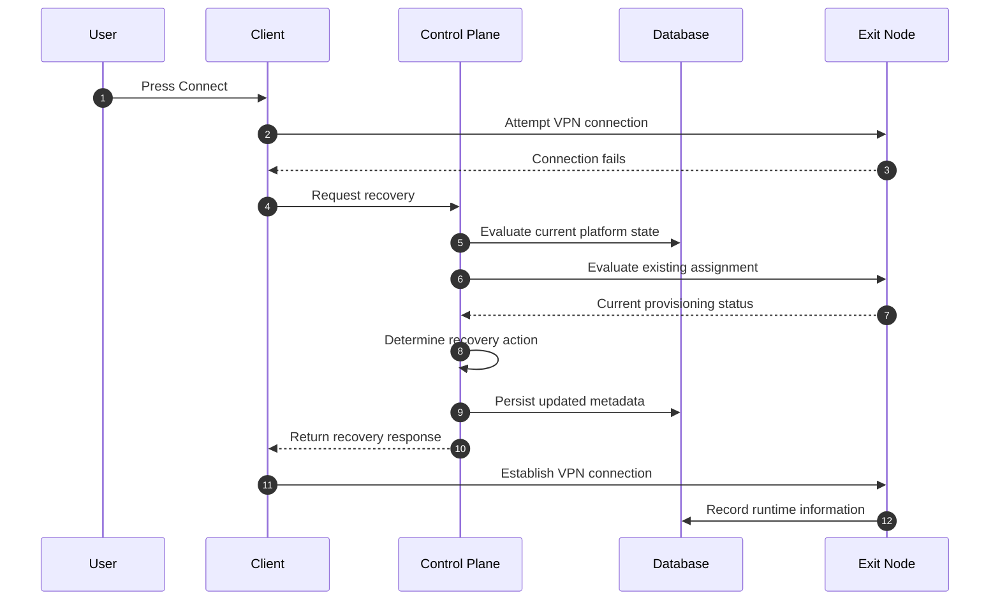
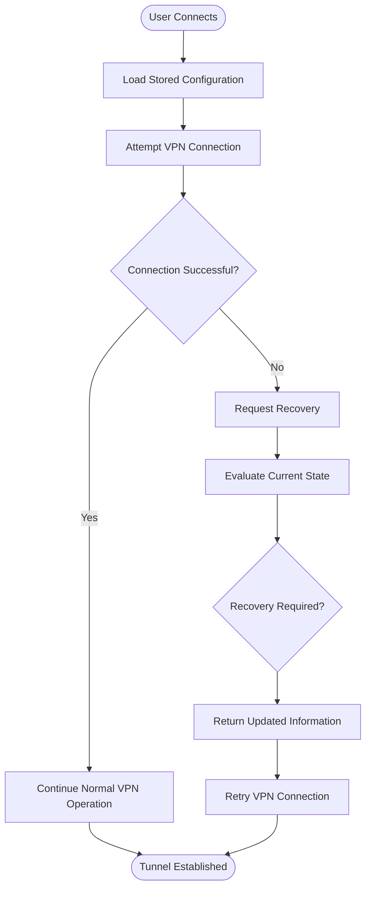
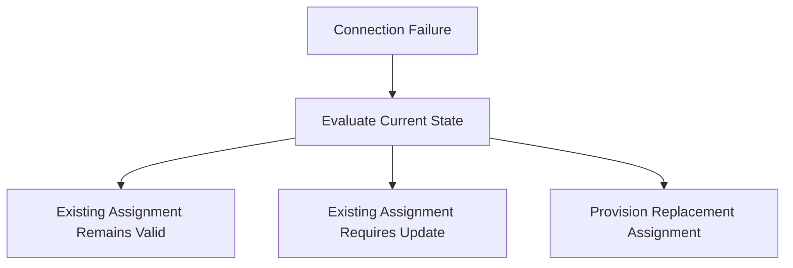
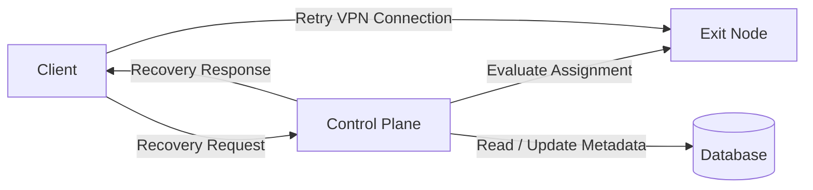

# Reprovisioning Sequence

> This document describes the recovery workflow used when a client already
> possesses a VPN configuration but is unable to establish a VPN connection.
>
> Unlike the initial provisioning workflow, the client already has an existing
> peer assignment. The objective of this workflow is to determine whether the
> existing configuration remains usable or whether a replacement configuration
> should be provisioned.

---

# Overview

Reprovisioning occurs when a previously provisioned device can no longer use its
stored VPN configuration.

The client first attempts a normal VPN connection.

If that attempt fails, the client requests assistance from the Control Plane.

The Control Plane evaluates the situation and determines the appropriate
recovery action.

This document intentionally does not define the recovery strategy.

---

# Example Recovery Scenarios

A reprovisioning workflow may occur for reasons including:

- Assigned Exit Node is unavailable.
- Stored configuration has become outdated.
- Infrastructure has changed.
- Peer assignment has been revoked.
- Region topology has changed.
- Configuration is no longer accepted.
- Existing peer is no longer usable.

Additional recovery scenarios may be introduced in future versions of the
platform.

---

# High-Level Sequence

---

# Recovery Workflow

---

# Participants

## User

The user performs the same interaction as a normal connection.

No additional user interaction is required.

The recovery process is intended to remain transparent.

---

## Client Application

Responsibilities include:

- Detecting connection failure.
- Determining that normal connection was unsuccessful.
- Requesting recovery.
- Receiving updated provisioning information.
- Reattempting the VPN connection.

The client does not determine the appropriate recovery strategy.

---

## Control Plane

The Control Plane coordinates the recovery process.

Its responsibilities include:

- Evaluating the existing assignment.
- Determining whether the assignment remains valid.
- Coordinating any required provisioning activity.
- Recording updated platform state.
- Returning the information required by the client.

---

## Exit Node

The Exit Node provides information about the existing peer assignment and
participates in any recovery operations requested by the Control Plane.

The Exit Node does not independently determine recovery policy.

---

## Database

Stores persistent platform information related to the recovery process,
including updated provisioning metadata where applicable.

---

# Conceptual Recovery Decisions

The Control Plane may determine that different recovery actions are appropriate
depending on the current platform state.

Possible conceptual outcomes include:

This document intentionally does not define how these decisions are made.

---

# Device Relationship

Recovery is performed for a specific device.

The conceptual ownership hierarchy remains unchanged.

A user may own multiple devices.

Each device may have its own peer assignment.

Recovery for one device does not necessarily affect other devices owned by the
same user.

---

# Communication Overview

Recovery communication occurs only after a normal VPN connection attempt has
failed.

---

# Architectural Characteristics

The reprovisioning workflow provides several architectural benefits.

## Transparent Recovery

The client follows the same user interaction regardless of whether recovery is
required.

The user continues to experience a simple connection workflow.

---

## Centralized Decision Making

Recovery decisions remain the responsibility of the Control Plane.

Exit Nodes continue to focus on networking responsibilities.

---

## Independent Infrastructure Evolution

Recovery policies may evolve without requiring changes to the overall
architecture.

Future versions of the platform may support additional recovery strategies while
preserving the same conceptual workflow.

---

## Device-Oriented Recovery

Recovery is performed for an individual device and its associated peer.

This allows independent recovery of multiple devices belonging to the same
user.

---

# Out of Scope

This document intentionally does not define:

- Retry limits
- Timeout durations
- Health evaluation algorithms
- Node selection strategy
- Configuration rotation strategy
- Peer replacement policy
- Configuration versioning
- Failure classification
- Infrastructure failover

These implementation details are expected to evolve independently from the
conceptual recovery workflow.

---

# Summary

The reprovisioning workflow begins only after a normal VPN connection attempt
has failed.

The Control Plane evaluates the current platform state and determines the
appropriate recovery action.

Possible outcomes include:

- Existing assignment remains usable.
- Existing assignment requires updating.
- A replacement assignment is provisioned.

Regardless of the recovery strategy, the objective remains the same:

1. Restore a valid VPN configuration for the device.
2. Re-establish a VPN tunnel.
3. Preserve the simple user experience of selecting a region and pressing
   **Connect**.

The next document,
**`06-subscription-revocation-sequence.md`**,
describes how subscription changes affect device provisioning and peer
revocation across the platform.
