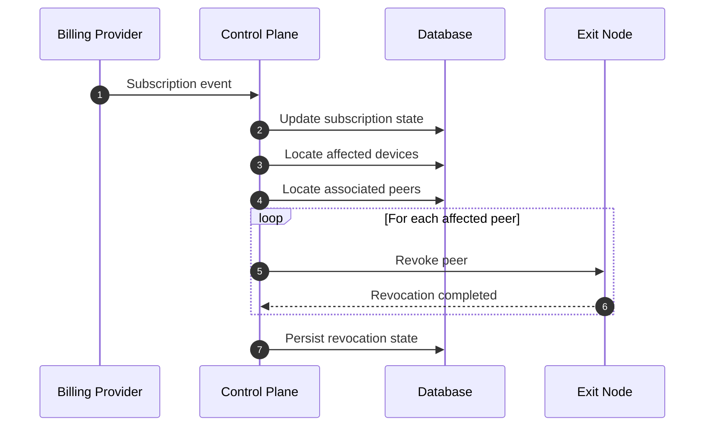
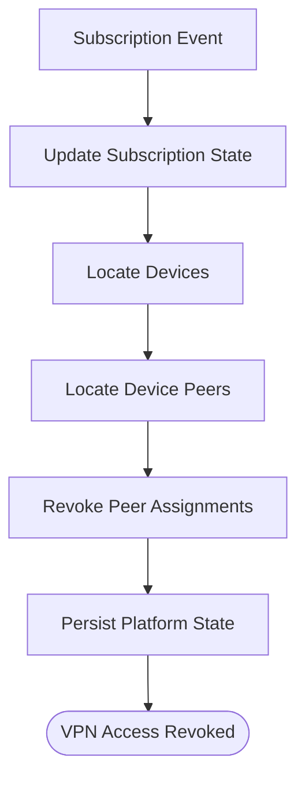
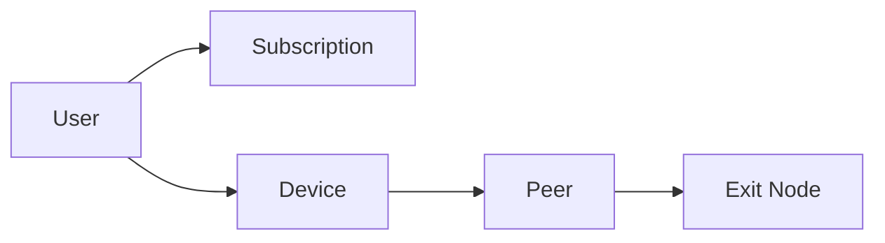
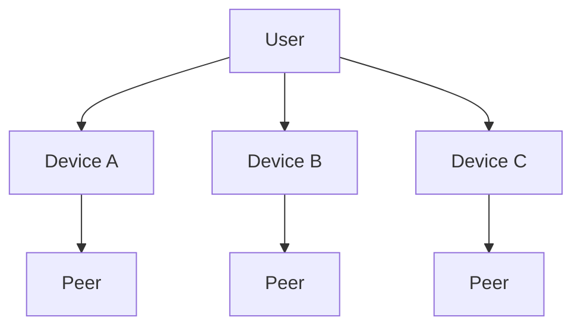
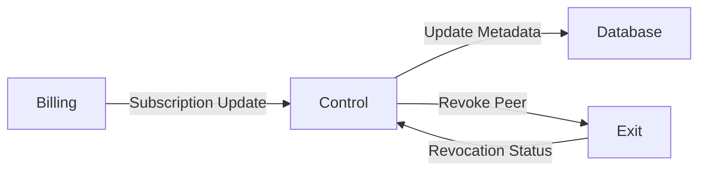
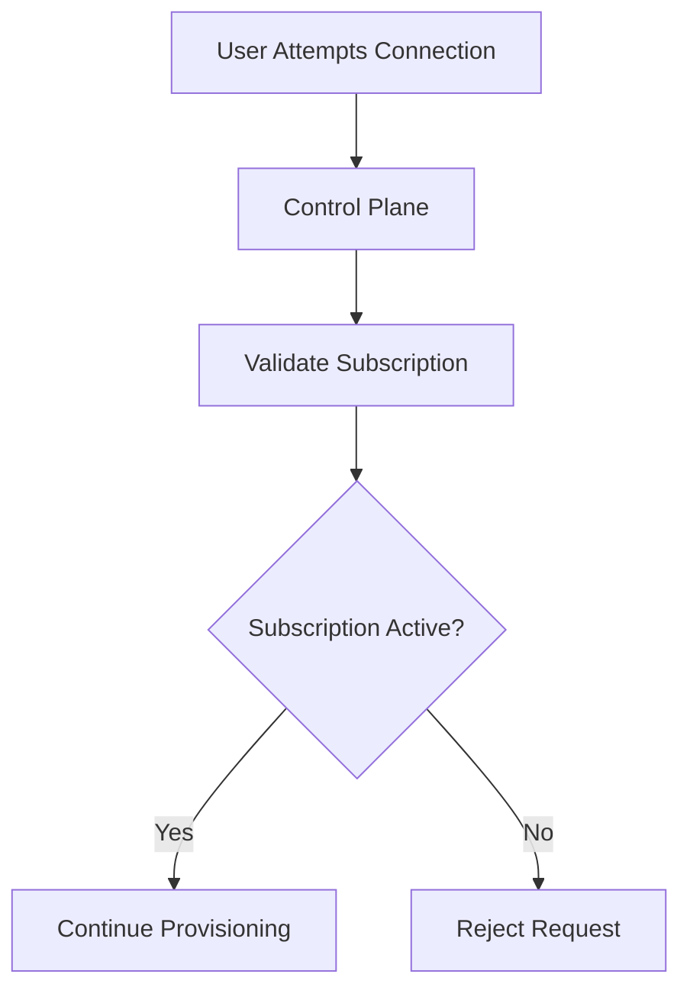

# Subscription Revocation Sequence

> This document describes the conceptual workflow that occurs when a user's VPN
> subscription is no longer valid.
>
> The purpose of this workflow is to ensure that devices associated with an
> inactive subscription can no longer establish VPN connections while keeping
> the platform's state consistent.
>
> This document intentionally avoids implementation-specific details regarding
> payment providers, webhooks, authentication providers, or revocation
> mechanisms.

---

# Overview

Subscription revocation is initiated whenever the platform determines that a
subscription should no longer provide VPN access.

Possible reasons include:

- Subscription expiration
- Subscription cancellation
- Failed recurring payment
- Administrative revocation
- Billing provider notification

Regardless of the reason, the objective remains the same:

1. Update the platform state.
2. Revoke VPN access.
3. Prevent future VPN connections.
4. Keep platform metadata consistent.

---

# High-Level Sequence

---

# Conceptual Workflow

---

# Domain Relationship

Subscription revocation propagates through the ownership hierarchy.

The subscription is associated with the user.

VPN access is ultimately enforced through the device's peer assignment.

---

# Participants

## Billing Provider

The billing system informs the platform that the subscription state has
changed.

This document intentionally does not specify the notification mechanism.

---

## Control Plane

The Control Plane coordinates the revocation process.

Responsibilities include:

- Receiving subscription updates.
- Updating subscription state.
- Locating affected devices.
- Identifying associated peers.
- Coordinating peer revocation.
- Recording platform state.

The Control Plane is the central orchestration layer.

---

## Database

The database stores persistent information including:

- Subscription state
- Device records
- Peer assignments
- Revocation history
- Platform metadata

The database acts as the persistent source of truth.

---

## Exit Node

The Exit Node removes or disables VPN access for the affected peer.

The exact mechanism is intentionally unspecified.

The Exit Node reports completion back to the Control Plane.

---

# Revocation Scope

The revocation process operates on device peers rather than directly on users.

If multiple devices exist, each associated peer may require revocation.

The Control Plane determines which peers are affected.

---

# Responsibility During Revocation

The Billing Provider never communicates directly with Exit Nodes.

The Control Plane coordinates all revocation activities.

---

# Resulting Platform State

After revocation completes:

- The subscription is inactive.
- Existing peer assignments are no longer usable.
- Future provisioning requests may be denied.
- Existing VPN connections may no longer remain valid.
- Platform metadata reflects the updated state.

The exact behavior for existing active VPN sessions is implementation-specific.

---

# Future Connection Attempts

After subscription revocation, future connection attempts conceptually follow
this path.

The validation logic itself is intentionally outside the scope of this
document.

---

# Architectural Characteristics

## Centralized Enforcement

Subscription enforcement remains a responsibility of the Control Plane.

Exit Nodes do not independently determine subscription validity.

---

## Consistent Platform State

Subscription updates and peer revocation are coordinated through a single
orchestration layer.

This reduces the likelihood of inconsistent platform state.

---

## Device-Based Access Control

VPN access is granted through device peers.

Revoking a subscription ultimately affects the peers associated with those
devices.

---

## Independent Evolution

Future billing providers, authentication providers, or payment processors may
be introduced without changing the conceptual revocation workflow.

---

# Out of Scope

This document intentionally does not define:

- Billing provider
- Payment processor
- Authentication provider
- Webhook implementation
- Revocation protocol
- Retry strategy
- Background jobs
- Distributed coordination
- Session termination policy
- Peer deletion strategy

These implementation details may evolve independently from the architecture.

---

# Summary

Subscription revocation is a platform-wide orchestration workflow.

The process begins when the platform detects that a subscription is no longer
valid.

The Control Plane:

1. Updates subscription state.
2. Locates affected devices.
3. Identifies associated peers.
4. Coordinates peer revocation.
5. Persists the resulting platform state.

This architecture ensures that VPN access is consistently enforced while
maintaining a clear separation between billing, orchestration, networking, and
persistent storage.

---

# Next Document

The next document,

**`07-domain-model.md`**,

defines the core entities of the platform and the relationships between them,
including Users, Devices, Peers, Regions, Exit Nodes, Subscriptions, and other
persistent domain objects.
