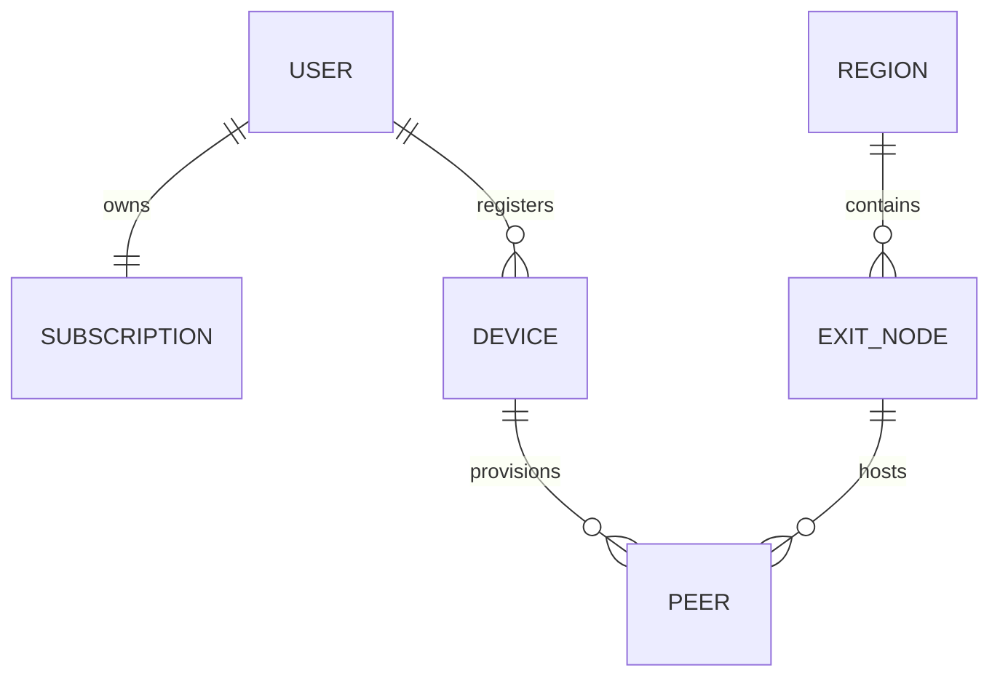
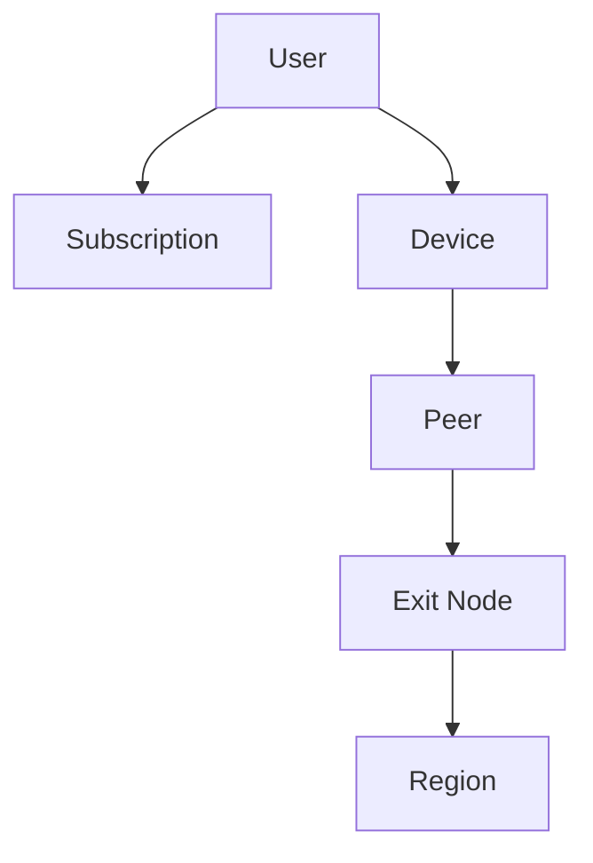
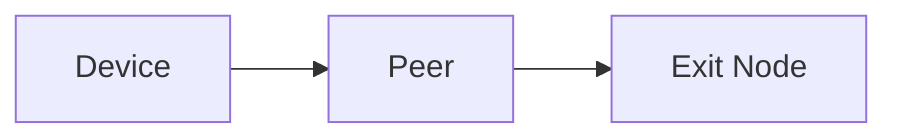
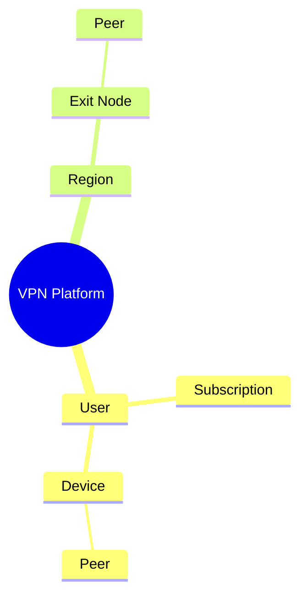

# Domain Model

> This document defines the core domain entities of the VPN platform and the
> relationships between them.
>
> The purpose of this document is to establish a common vocabulary for the
> system and describe ownership relationships between entities.
>
> This document intentionally avoids database implementation details, ORM
> design, and API definitions.

---

# Overview

The VPN platform consists of several core domain entities.

Each entity represents a long-lived concept within the platform.

These entities form the foundation of:

- Database design
- Business logic
- API design
- Provisioning workflows
- Future system evolution

---

# Domain Overview



This diagram illustrates ownership relationships only.

It intentionally does not describe runtime workflows.

---

# Domain Hierarchy



A peer belongs to a specific device.

A device belongs to a user.

An Exit Node belongs to a region.

---

# Entity Descriptions

---

# User

## Purpose

Represents an authenticated customer of the VPN platform.

The user is the top-level owner of personal resources.

---

## Owns

A user conceptually owns:

- Subscription
- Devices

The user does not directly own VPN peers.

Peers are owned by devices.

---

## Responsibilities

The user is responsible for:

- Authentication
- Subscription ownership
- Device ownership

---

# Subscription

## Purpose

Represents the user's entitlement to VPN services.

The subscription determines whether VPN provisioning may be performed.

---

## Responsibilities

Examples include:

- Active status
- Expiration
- Renewal
- Billing state

This document intentionally avoids describing billing implementation.

---

# Device

## Purpose

Represents a single physical or virtual device belonging to a user.

Examples include:

- Desktop
- Laptop
- Mobile phone
- Tablet

---

## Responsibilities

A device represents:

- Device identity
- Device registration
- Local VPN configuration
- Provisioned VPN peers

The device acts as the owner of VPN peers.

---

## Ownership


Each peer belongs to exactly one device.

A device may own multiple peers over its lifetime.

---

# Peer

## Purpose

Represents a VPN identity associated with a device.

A peer is the entity ultimately accepted by an Exit Node.

The peer is not directly associated with the user.

---

## Responsibilities

A peer conceptually represents:

- Device VPN identity
- VPN configuration
- Exit Node assignment
- Provisioning lifecycle

---

## Relationship



A peer exists to connect one device to one Exit Node.

---

# Region

## Purpose

Represents a logical VPN location visible to customers.

Examples:

- Germany
- Japan
- Singapore
- United States

A region groups one or more Exit Nodes.

---

## Responsibilities

A region conceptually provides:

- Geographic identity
- Customer-visible location
- Exit Node grouping

The region itself does not transport VPN traffic.

---

# Exit Node

## Purpose

Represents a VPN server capable of accepting VPN peers.

Exit Nodes form the VPN data plane.

---

## Responsibilities

Conceptually an Exit Node:

- Hosts VPN peers
- Accepts VPN connections
- Encrypts traffic
- Forwards Internet traffic

Business decisions remain outside the Exit Node.

---

## Relationship


An Exit Node belongs to one region.

It may host many peers.

---

# Entity Ownership


Ownership flows downward.

Provisioning generally follows the same hierarchy.

---

# Cardinality

| Entity    | Relationship | Target                         |
| --------- | ------------ | ------------------------------ |
| User      | owns         | One Subscription               |
| User      | owns         | Many Devices                   |
| Device    | owns         | Many Peers (over its lifetime) |
| Region    | contains     | Many Exit Nodes                |
| Exit Node | hosts        | Many Peers                     |

The exact cardinality may evolve as the platform grows.

---

# Conceptual Ownership



The mind map illustrates conceptual ownership rather than runtime
communication.

---

# Runtime Relationships

During normal operation:

- Users interact with Devices.
- Devices connect using Peers.
- Peers communicate with Exit Nodes.
- Exit Nodes belong to Regions.

The entities remain conceptually independent from implementation details.

---

# Entity Responsibilities

| Entity       | Primary Responsibility |
| ------------ | ---------------------- |
| User         | Platform identity      |
| Subscription | Access entitlement     |
| Device       | Device identity        |
| Peer         | VPN identity           |
| Region       | Logical VPN location   |
| Exit Node    | VPN connectivity       |

Each entity should have a focused responsibility.

---

# Design Principles

## User-Centric Ownership

Resources ultimately belong to users.

---

## Device-Oriented Provisioning

VPN provisioning occurs for devices.

Not directly for users.

---

## Peer-Oriented Connectivity

VPN connections are established through peers.

The peer is the networking identity.

---

## Region Abstraction

Users select regions.

They do not directly select Exit Nodes.

The Control Plane determines the appropriate Exit Node.

---

## Separation of Business and Networking

Business entities:

- User
- Subscription
- Device

Networking entities:

- Peer
- Exit Node
- Region

Keeping these concepts separate allows each part of the platform to evolve
independently.

---

# Out of Scope

This document intentionally does not define:

- Database tables
- Primary keys
- Foreign keys
- API contracts
- Authentication providers
- Billing providers
- VPN protocol details
- Provisioning algorithms

These implementation concerns are documented elsewhere.

---

# Summary

The domain model establishes the conceptual structure of the platform.

The primary ownership hierarchy is:

```text
User
├── Subscription
└── Devices
      └── Peers
            └── Exit Node
                  └── Region
```

This hierarchy serves as the foundation for the platform's architecture,
business logic, provisioning workflows, and future database design.

---

# Next Document

The next document,

**`08-peer-lifecycle-state-machine.md`**,

describes the conceptual lifecycle of a VPN peer from initial provisioning
through active operation, recovery, and eventual revocation.
