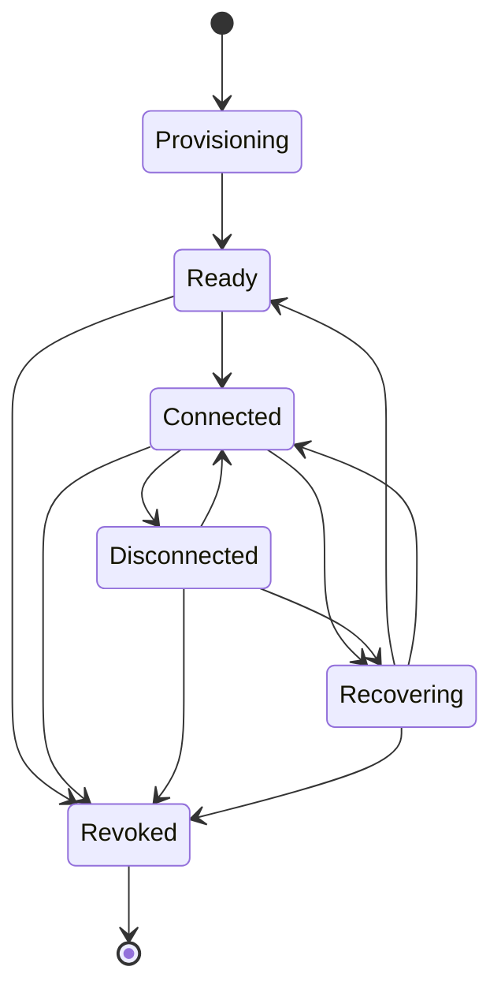
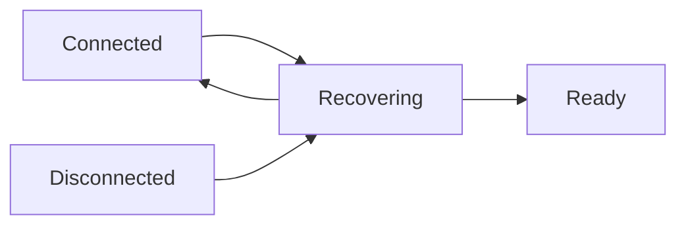
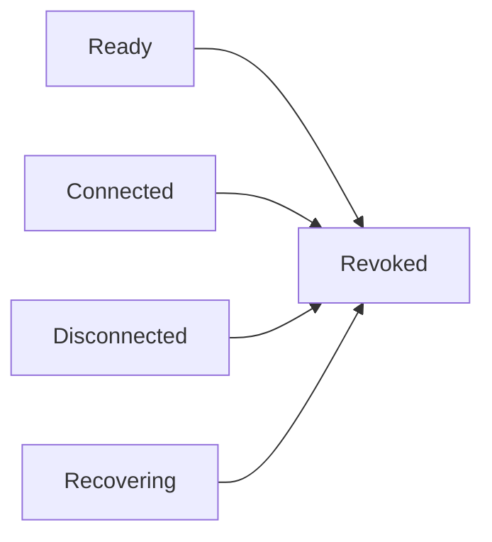
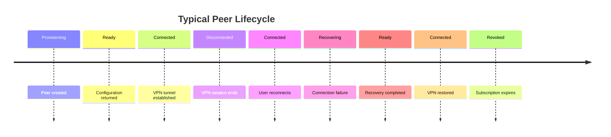
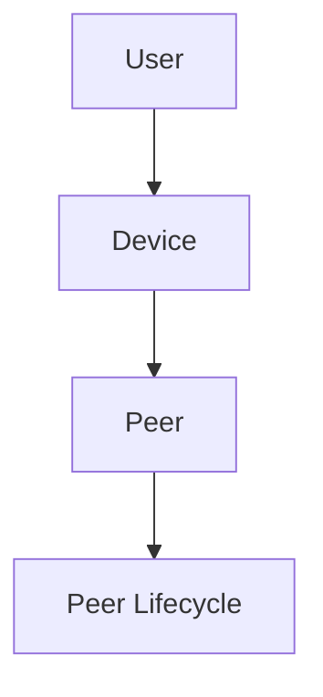
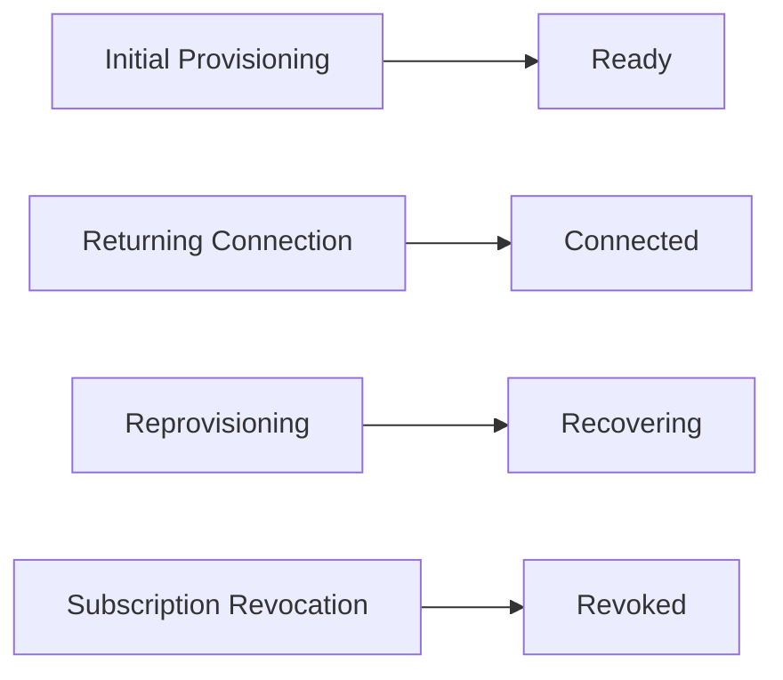

# Peer Lifecycle State Machine

> This document describes the conceptual lifecycle of a VPN peer.
>
> The purpose of this document is to explain how a peer moves through its
> lifetime as provisioning, VPN connectivity, recovery, and subscription
> changes occur.
>
> This document intentionally defines conceptual states rather than database
> values or implementation-specific enums.

---

# Overview

A peer represents the VPN identity of a device.

It is created during provisioning and remains associated with the device until
it is no longer usable.

Throughout its lifetime, the peer transitions through a number of conceptual
states.

These states help describe the architecture without constraining the
implementation.

---

# Lifecycle Overview



The state machine illustrates the conceptual lifecycle of a peer.

It intentionally omits implementation details such as retries, timers,
background jobs, and networking protocols.

---

# State Descriptions

## Provisioning

### Purpose

The peer is being created for a device.

Typical activities may include:

- Device validation
- Peer registration
- Exit Node assignment
- Configuration generation
- Metadata persistence

The peer is not yet available for VPN connections.

---

## Ready

### Purpose

Provisioning has completed successfully.

The peer is now capable of accepting VPN connections.

The device may store the associated VPN configuration for future use.

---

## Connected

### Purpose

The device has successfully established a VPN tunnel using the peer.

During this state:

- VPN traffic flows normally.
- The Exit Node maintains the active VPN session.
- Runtime information may be generated.

The peer remains available until the VPN connection ends or recovery becomes
necessary.

---

## Disconnected

### Purpose

The VPN tunnel is no longer active.

Possible reasons include:

- User disconnects.
- Network interruption.
- Device shutdown.
- Exit Node becomes unavailable.
- VPN tunnel naturally terminates.

The peer itself still exists.

The device may reconnect later without requiring provisioning.

---

## Recovering

### Purpose

The stored configuration is no longer sufficient to establish a VPN
connection.

The Control Plane evaluates the existing peer assignment and determines the
appropriate recovery action.

Possible conceptual outcomes include:

- Existing peer remains valid.
- Peer metadata is updated.
- Replacement provisioning occurs.

The recovery strategy is intentionally undefined.

---

## Revoked

### Purpose

The peer is no longer permitted to establish VPN connections.

Possible reasons include:

- Subscription expiration.
- Administrative revocation.
- Device removal.
- Security event.
- Infrastructure changes.

A revoked peer should no longer be considered usable.

---

# State Transitions

## Initial Provisioning


Provisioning completes successfully and the peer becomes available for future
VPN connections.

---

## Successful Connection


The device establishes a VPN tunnel using the peer.

---

## Normal Disconnect


The VPN session ends while the peer remains provisioned.

---

## Reconnection


The device reconnects using the same peer.

No reprovisioning is required.

---

## Recovery



Recovery is initiated after a connection failure or another event requiring
evaluation by the Control Plane.

The resulting state depends on the recovery strategy.

---

## Revocation



Revocation permanently ends the usable lifecycle of the peer.

---

# Lifecycle Timeline



The timeline illustrates one possible lifecycle.

Actual peer lifecycles may differ depending on operational events.

---

# Relationship to Device



The lifecycle belongs to the peer.

The device owns the peer throughout its lifetime.

---

# Relationship to Provisioning



Each architectural workflow interacts with different stages of the peer
lifecycle.

---

# Conceptual Characteristics

## Device-Oriented

The lifecycle belongs to a device's peer.

Multiple devices owned by the same user progress independently.

---

## Control Plane Coordination

State transitions requiring business decisions are coordinated by the Control
Plane.

Examples include:

- Provisioning
- Recovery
- Revocation

---

## Exit Node Responsibility

The Exit Node primarily participates in runtime networking.

It does not independently define the peer lifecycle.

---

## Independent Evolution

Future platform features may introduce additional lifecycle states without
changing the overall conceptual model.

Examples include:

- Suspended
- Migrating
- Expiring
- Maintenance
- Pending Removal

These are intentionally excluded from the current MVP architecture.

---

# Out of Scope

This document intentionally does not define:

- Database enums
- Status columns
- Retry counts
- Timeout values
- Event processing
- Background workers
- Notification systems
- Health monitoring
- Node migration algorithms

These implementation details are expected to evolve independently of the
conceptual lifecycle.

---

# Summary

A peer progresses through a predictable conceptual lifecycle.

The typical lifecycle is:

```text
Provisioning
      │
      ▼
Ready
      │
      ▼
Connected
      │
      ▼
Disconnected
      │
      └──────────────┐
      ▼              │
Recovering           │
      │              │
      └──────► Ready │
                     │
                     ▼
                Connected

Any operational state
        │
        ▼
     Revoked
```

The lifecycle provides a shared architectural vocabulary for provisioning,
runtime operation, recovery, and revocation without prescribing a specific
implementation strategy.

---

# Next Document

The final document,

**`09-request-flows-summary.md`**,

provides a consolidated overview of all major request flows within the VPN
platform, showing how the various architectural workflows relate to one
another.
