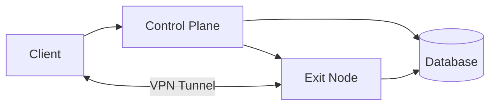
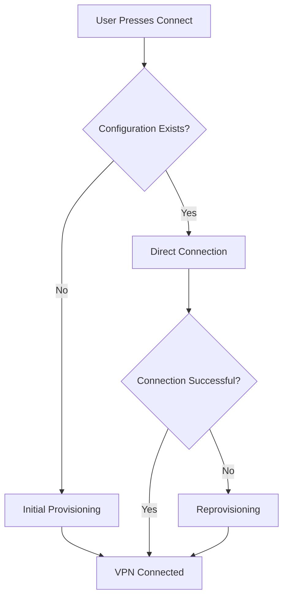
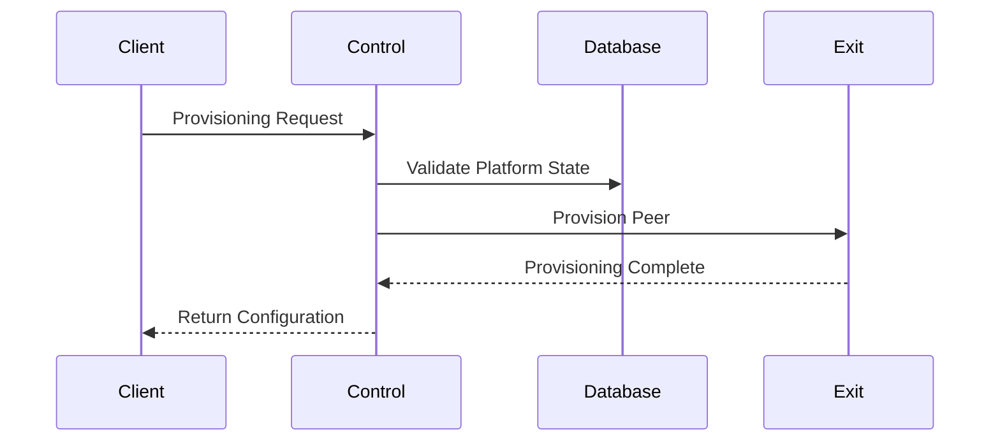
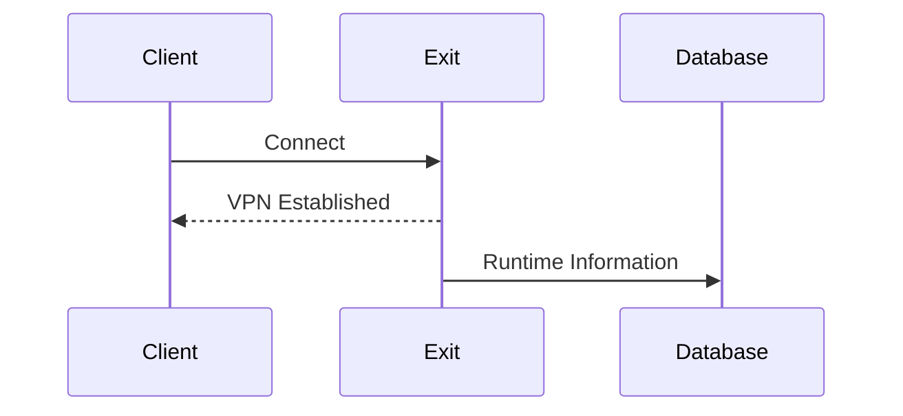
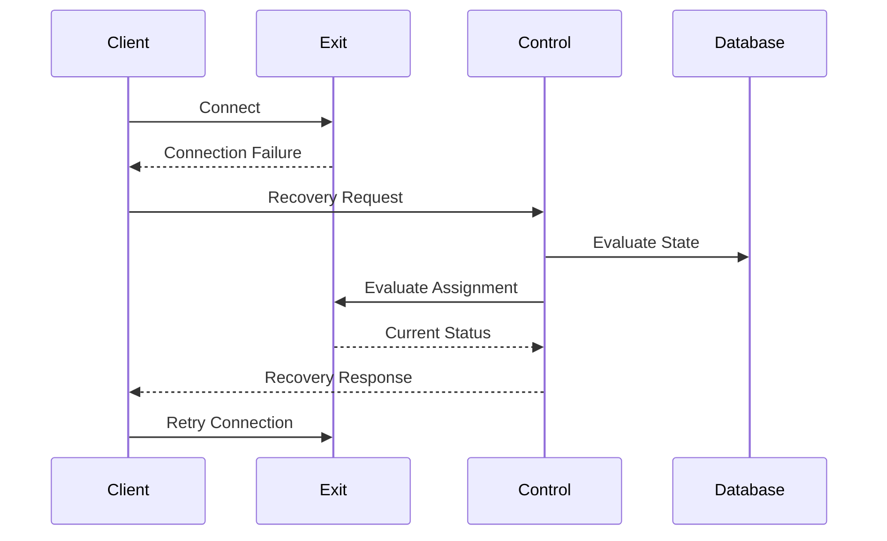
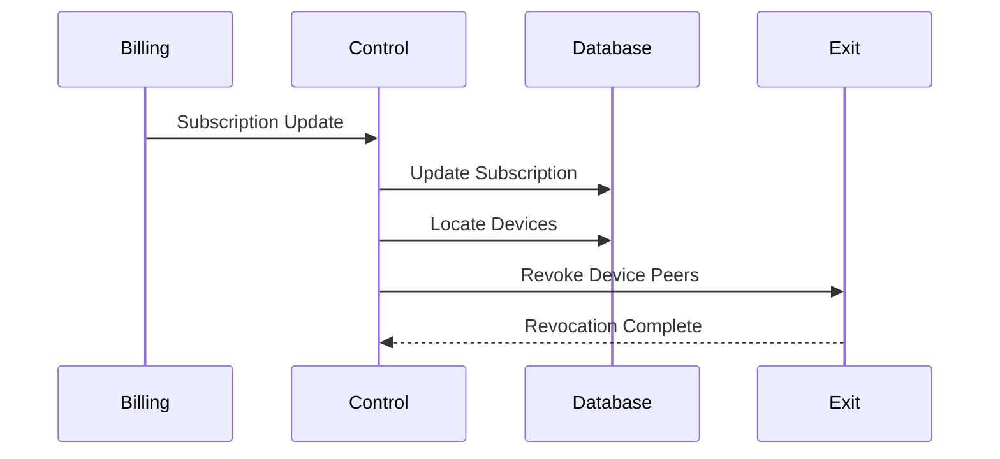
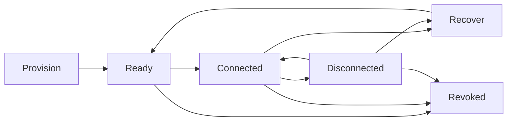
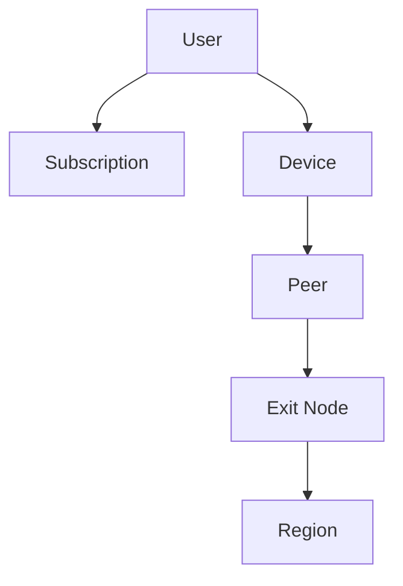
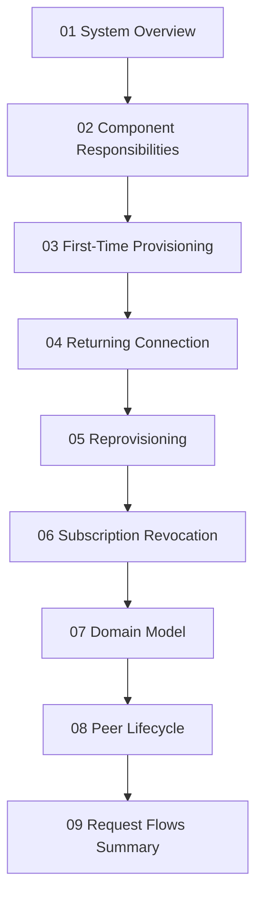
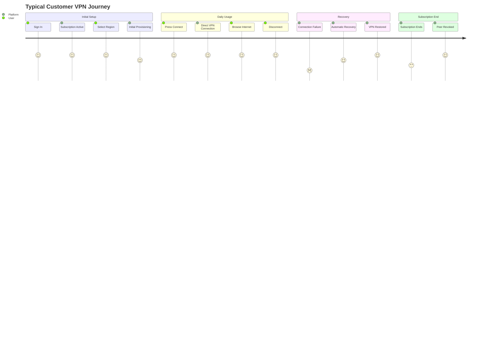

# Request Flows Summary

> This document provides a consolidated overview of the primary request flows
> within the VPN platform.
>
> It summarizes how the Client, Control Plane, Database, and Exit Nodes
> collaborate during the normal lifecycle of the system.
>
> Individual workflows are documented in detail elsewhere. This document serves
> as a high-level navigation guide and architectural summary.

---

# Overview

The platform consists of four primary request flows:

1. Initial Provisioning
2. Returning Connection
3. Reprovisioning
4. Subscription Revocation

These workflows together describe the complete operational lifecycle of a VPN
device.

---

# Architecture Overview

The Control Plane orchestrates platform operations.

The Exit Node transports VPN traffic.

The Client provides the user experience.

The Database stores persistent platform information.

---

# Workflow Overview

This diagram illustrates the decision points involved in establishing a VPN
connection.

---

# Workflow 1 — Initial Provisioning

## Purpose

Provision a VPN peer for a device that does not yet possess a usable VPN
configuration.

### Participants

- Client
- Control Plane
- Database
- Exit Node

### Summary

Result:

- Device receives VPN configuration.
- Peer is provisioned.
- Future connections may use the stored configuration.

See:

**03-first-time-provisioning-sequence.md**

---

# Workflow 2 — Returning Connection

## Purpose

Reuse an existing VPN configuration without contacting the Control Plane.

### Participants

- Client
- Exit Node
- Database

### Summary

Result:

- Fast connection.
- Minimal infrastructure usage.
- Control Plane remains outside the VPN data path.

See:

**04-returning-connection-sequence.md**

---

# Workflow 3 — Reprovisioning

## Purpose

Recover from a failed VPN connection using an existing device.

### Participants

- Client
- Control Plane
- Database
- Exit Node

### Summary

Result:

- Existing assignment may remain valid.
- Configuration may be updated.
- Replacement provisioning may occur.

See:

**05-reprovisioning-sequence.md**

---

# Workflow 4 — Subscription Revocation

## Purpose

Remove VPN access after a subscription is no longer valid.

### Participants

- Billing Provider
- Control Plane
- Database
- Exit Node

### Summary

Result:

- Device peers are revoked.
- Future provisioning may be denied.
- VPN access is removed.

See:

**06-subscription-revocation-sequence.md**

---

# Platform Lifecycle

This diagram summarizes the conceptual lifecycle described throughout the
architecture documentation.

---

# Component Participation

| Workflow                | Client | Control Plane | Database | Exit Node |
| ----------------------- | :----: | :-----------: | :------: | :-------: |
| Initial Provisioning    |   ✓    |       ✓       |    ✓     |     ✓     |
| Returning Connection    |   ✓    |               |    ✓     |     ✓     |
| Reprovisioning          |   ✓    |       ✓       |    ✓     |     ✓     |
| Subscription Revocation |        |       ✓       |    ✓     |     ✓     |

---

# Domain Relationships

This ownership hierarchy remains consistent across every workflow described in
the architecture.

---

# Architectural Principles

The workflows presented throughout these documents follow several consistent
principles.

## Simple User Experience

The customer interaction remains consistent:

1. Select a region.
2. Press **Connect**.

Operational complexity remains inside the platform.

---

## Separation of Responsibilities

- Client handles user interaction.
- Control Plane performs orchestration.
- Exit Nodes provide VPN connectivity.
- Database stores persistent platform state.

---

## Device-Oriented Provisioning

Provisioning occurs for devices rather than directly for users.

Devices own peers.

Peers establish VPN connectivity.

---

## Independent Scaling

Each architectural component may scale independently.

Future deployments may contain:

- Multiple Control Plane instances
- Multiple Exit Nodes
- Multiple Regions
- Additional infrastructure services

The conceptual workflows remain unchanged.

---

# Documentation Map

The documents are intended to be read in this order, progressing from
high-level concepts to detailed workflows and finally to a consolidated
summary.

---

# Complete Connection Journey

This journey represents the complete conceptual lifecycle of a customer using
the VPN platform.

---

# Final Notes

This architecture documentation intentionally focuses on **conceptual system
design** rather than implementation.

As the platform evolves, implementation details such as APIs, deployment
topology, database schemas, monitoring, security mechanisms, and infrastructure
can change while preserving the architectural concepts documented here.

The goal of these documents is to provide a stable foundation that guides
future development without constraining implementation choices.
