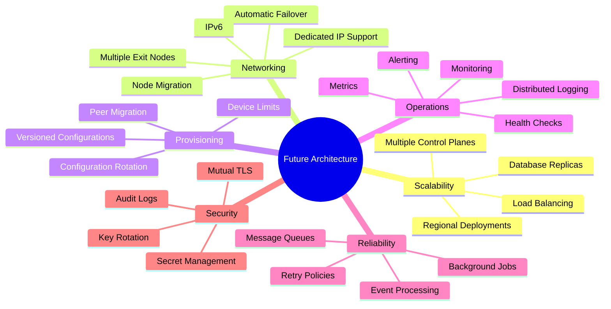
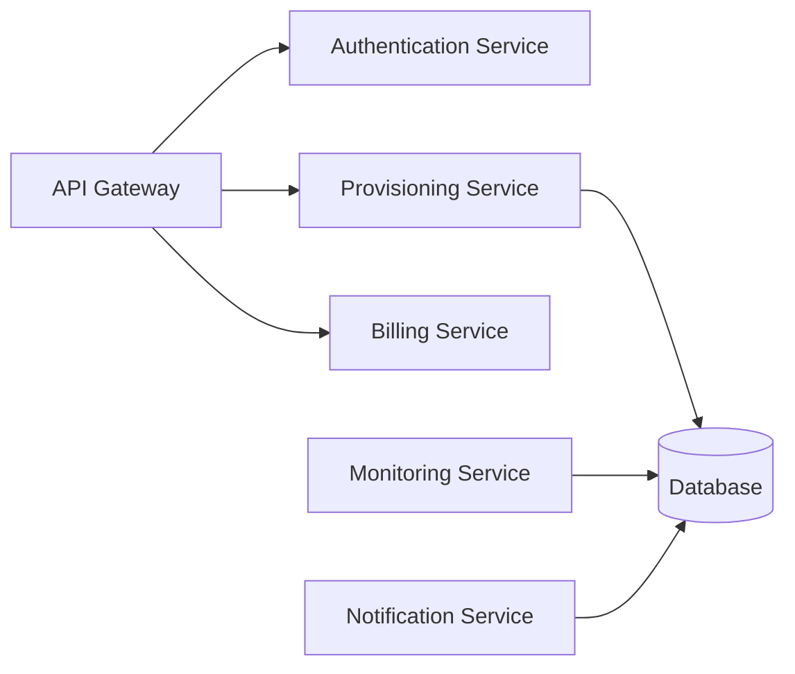
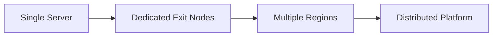

# Future Architecture Considerations

> This document captures architectural ideas and possible future enhancements
> that are intentionally **outside the scope of the MVP**.
>
> None of the topics described here should be considered implementation
> requirements for the current version of the platform.
>
> The purpose of this document is to preserve architectural direction while
> allowing the MVP to remain intentionally simple.

---

# Guiding Principle

The MVP architecture is designed to solve today's problems.

Future architecture should only be introduced when supported by operational
requirements such as:

- Increased user growth
- Operational complexity
- Infrastructure limitations
- Performance bottlenecks
- Security requirements

Until those requirements exist, simplicity should be preferred.

---

# Current MVP

The current MVP intentionally assumes:

- Single Control Plane instance
- Single Database instance
- One or more Exit Nodes
- Direct communication between components
- Simple provisioning workflow
- Minimal infrastructure

This architecture should remain the baseline until additional complexity is
justified.

---

# Future Roadmap

---

# Scalability

As the platform grows, additional infrastructure may become necessary.

Potential future improvements include:

- Multiple Control Plane instances
- Horizontal scaling
- Regional deployments
- Load balancing
- Distributed orchestration

These improvements should only be introduced when required.

---

# Multiple Exit Nodes per Region

The current architecture already supports the concept of regions containing
multiple Exit Nodes.

Future implementations may introduce:

- Load-aware routing
- Geographic optimization
- Automatic node selection
- Capacity balancing
- Node draining
- Rolling maintenance

The current MVP does not require these features.

---

# Node Health Monitoring

Future versions of the platform may continuously monitor Exit Nodes.

Possible metrics include:

- CPU utilization
- Memory utilization
- Active peers
- Network throughput
- Packet loss
- Latency
- Handshake activity
- Interface status

These metrics may influence future node selection.

---

# Intelligent Node Selection

The current architecture intentionally leaves node selection undefined.

Future strategies may consider:

- Geographic proximity
- Current load
- Available capacity
- Latency
- Health score
- Historical reliability
- Regional availability

The selection algorithm should remain replaceable.

---

# Configuration Versioning

Future versions may associate version information with VPN configurations.

Possible benefits include:

- Safe configuration updates
- Rolling migrations
- Automatic upgrades
- Client compatibility
- Recovery after infrastructure changes

The MVP assumes a single valid configuration.

---

# Peer Migration

Future implementations may support moving devices between Exit Nodes without
requiring manual intervention.

Possible reasons include:

- Hardware maintenance
- Infrastructure upgrades
- Load balancing
- Regional optimization
- Capacity management

The migration strategy is intentionally undefined.

---

# Background Processing

Some operations may eventually be executed asynchronously.

Examples include:

- Provisioning tasks
- Peer cleanup
- Subscription processing
- Notification delivery
- Metrics aggregation
- Scheduled maintenance

The MVP performs these operations synchronously whenever practical.

---

# Event-Driven Architecture

Future platform growth may benefit from event-based communication.

Possible events include:

- Device registered
- Peer provisioned
- Peer revoked
- Subscription changed
- Exit Node became unhealthy
- Region capacity changed

The MVP does not require an event bus.

---

# Distributed Architecture

The platform may eventually evolve into multiple independently scalable
services.

Possible future services include:

The MVP intentionally combines these responsibilities into a smaller number of
components.

---

# Monitoring and Observability

Future operational tooling may include:

- Metrics collection
- Distributed tracing
- Centralized logging
- Performance dashboards
- Infrastructure monitoring
- Alerting
- Audit reporting

These capabilities become increasingly valuable as the platform grows.

---

# Security Enhancements

Possible future security improvements include:

- Mutual TLS between services
- Automatic key rotation
- Hardware-backed secret storage
- Enhanced audit logging
- Device trust validation
- Infrastructure identity management

The MVP should prioritize correctness and simplicity before introducing
additional security layers.

---

# Deployment Evolution

The deployment model may evolve over time.

Possible future stages include:

Each stage builds upon the previous architecture without fundamentally changing
the platform's conceptual design.

---

# Architecture Principles

Future development should continue to follow several core principles.

## Preserve Separation of Concerns

Maintain a clear distinction between:

- Client
- Control Plane
- Data Plane
- Persistent Storage

---

## Prefer Evolution Over Replacement

Extend existing architecture before replacing it.

Architectural evolution should be incremental whenever possible.

---

## Delay Complexity

Infrastructure should become more sophisticated only when operational needs
justify it.

Premature optimization should be avoided.

---

## Maintain Stable Domain Concepts

Core entities such as:

- User
- Subscription
- Device
- Peer
- Exit Node
- Region

should remain stable even as implementation changes.

---

## Keep User Experience Simple

Regardless of future infrastructure complexity, the intended customer workflow
should remain as simple as possible.

The long-term goal continues to be:

1. Select a region.
2. Press **Connect**.

Everything else should remain an internal platform concern.

---

# Future Topics

Additional documents may eventually be created for topics such as:

- Infrastructure deployment
- Security architecture
- Database architecture
- API architecture
- Monitoring architecture
- Operations handbook
- Disaster recovery
- Scaling guide
- Performance tuning
- Administrative tooling

These topics are intentionally excluded from the MVP architecture.

---

# Final Notes

This document is not a roadmap or implementation plan.

Instead, it serves as a collection of architectural considerations that may
become relevant as the platform evolves.

Future development should continue to prioritize simplicity, maintainability,
and clear separation of responsibilities while allowing the platform to grow
incrementally as real-world requirements emerge.
