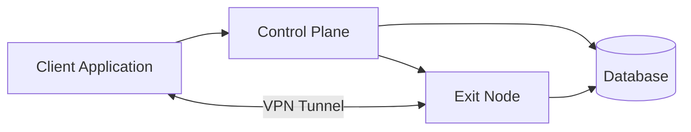
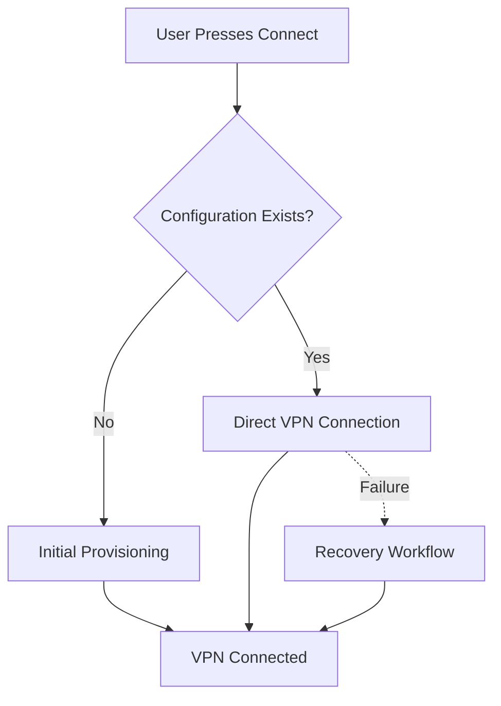
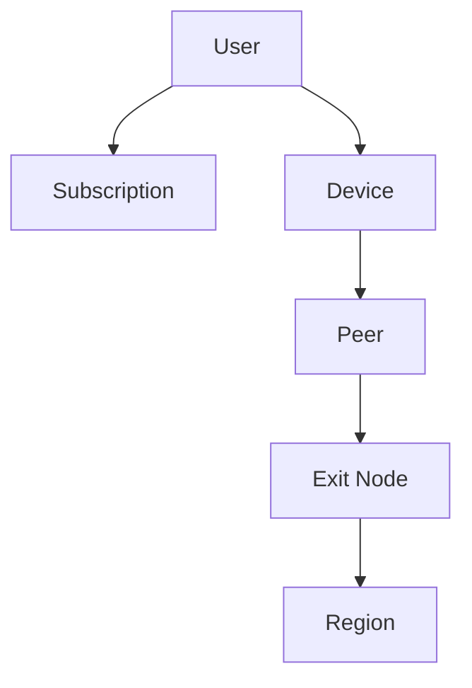

# VPN MVP Architecture

Welcome to the architecture documentation for the VPN MVP.

This directory contains the conceptual architecture of the platform.

The goal of these documents is to explain **how the system is organized**, **how its major components interact**, and **why the architecture is structured this way**.

These documents intentionally focus on concepts rather than implementation details.

Topics such as API endpoints, database schemas, deployment configuration, and source code belong in their own documentation.

---

# Architecture Goals

The architecture is designed around a small number of guiding principles.

- Simple user experience
- Clear separation of responsibilities
- Device-oriented provisioning
- Stateless Control Plane whenever practical
- Independent component scaling
- Maintainable domain model
- Incremental evolution over premature complexity

For the customer, the intended experience is always:

1. Sign in.
2. Purchase a subscription.
3. Select a VPN region.
4. Press **Connect**.

The complexity required to make this experience reliable remains inside the
platform.

---

# High-Level Architecture

The platform consists of four primary components.

- **Client Application** — User interface and VPN client.
- **Control Plane** — Business logic and orchestration.
- **Exit Node** — VPN networking and Internet egress.
- **Database** — Persistent platform state.

---

# Documentation Structure

The documents are intended to be read in order.

| Document                                     | Purpose                                                                   |
| -------------------------------------------- | ------------------------------------------------------------------------- |
| **01-system-overview.md**                    | Introduces the overall architecture and primary components.               |
| **02-component-responsibilities.md**         | Defines the responsibility boundaries for each component.                 |
| **03-first-time-provisioning-sequence.md**   | Describes how a device is provisioned for its first VPN connection.       |
| **04-returning-connection-sequence.md**      | Explains the optimized workflow for devices with existing configurations. |
| **05-reprovisioning-sequence.md**            | Covers recovery when an existing configuration can no longer be used.     |
| **06-subscription-revocation-sequence.md**   | Describes how subscription changes revoke VPN access.                     |
| **07-domain-model.md**                       | Defines the core entities and ownership relationships.                    |
| **08-peer-lifecycle-state-machine.md**       | Explains the conceptual lifecycle of a VPN peer.                          |
| **09-request-flows-summary.md**              | Summarizes all major request flows across the platform.                   |
| **10-future-architecture-considerations.md** | Records architectural ideas intentionally excluded from the MVP.          |

---

# Conceptual Workflow

The majority of VPN connections should follow the **Returning Connection**
workflow.

Provisioning and recovery are exceptional workflows that occur only when
necessary.

---

# Core Domain Model

This ownership hierarchy is referenced throughout the architecture.

Provisioning occurs for devices.

VPN connectivity occurs through peers.

Regions abstract one or more Exit Nodes.

---

# Scope

These documents intentionally describe **what** the system does rather than
**how** it is implemented.

Topics intentionally excluded include:

- REST or RPC APIs
- Database schema
- ORM models
- Deployment configuration
- Infrastructure provisioning
- Authentication implementation
- Payment provider integration
- VPN protocol implementation
- Monitoring configuration

Those subjects should be documented independently.

---

# Design Philosophy

Several principles guide the architecture.

## Simplicity First

The MVP should solve current requirements without introducing unnecessary
complexity.

---

## Separation of Concerns

Each component has a clearly defined responsibility.

- Client manages user interaction.
- Control Plane coordinates platform operations.
- Exit Nodes provide VPN connectivity.
- Database stores persistent state.

---

## Evolutionary Design

The architecture should evolve gradually as operational requirements emerge.

Future enhancements are documented separately to avoid increasing the complexity
of the MVP.

---

## Stable Domain Language

Concepts such as:

- User
- Subscription
- Device
- Peer
- Exit Node
- Region

should remain stable even as implementation details change.

---

# Reading Guide

Different readers may prefer different starting points.

| If you want to understand... | Read... |
| ---------------------------- | ------- |
| Overall architecture         | 01 → 02 |
| Connection workflow          | 03 → 05 |
| Billing and revocation       | 06      |
| Domain entities              | 07      |
| Peer lifecycle               | 08      |
| Complete platform behavior   | 09      |
| Future direction             | 10      |

---

# Final Notes

This documentation represents the conceptual architecture of the VPN MVP.

It is intended to remain stable even as implementation details evolve.

Whenever implementation changes, preference should be given to preserving the
architectural concepts described here unless a deliberate architectural decision
is made to change them.

The architecture should continue to prioritize:

- Simplicity
- Clear ownership
- Maintainability
- Scalability
- Consistent user experience

As the platform grows, new documentation should extend this foundation rather
than replace it.
